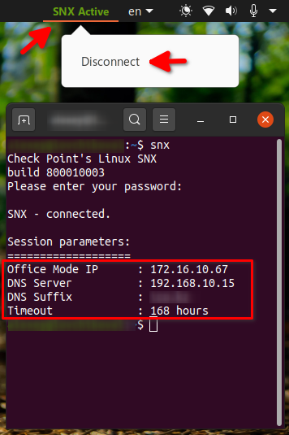
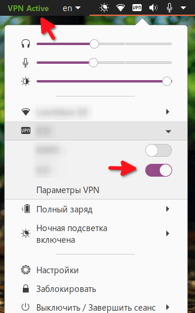

## VPN and SNX Indicator Extension

 

This is Fork at https://github.com/howdoicomputer/vpn-indicator-shell-extension

The extension adds an indicator to the menu with information about the active VPN or SNX connection.

If you use SNX you can dissconnect it from context menu.

Documentation for anyone stumbling across this repo:

* http://smasue.github.io/gnome-shell-tw

## Installation

1. `git clone https://github.com/alexeylovchikov/vpn-indicator-shell-extension.git`
2. `./install.sh`

3. Then you'll want to activate the plugin either by using the Gnome Tweak Tool or by execing `gnome-shell-extension-prefs` and using that UI.

---
